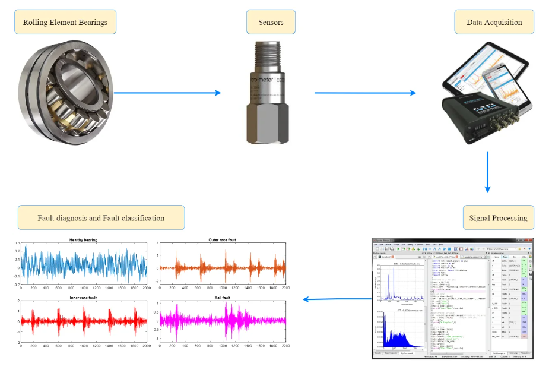

# Data Scientist

#### Technical Skills: Python, R, SQL, POWER BI, Machine Learning

## Education								       		
- Masters, Artificial Intelligence for Business | SP Jain School of Global Management (_Oct 2021 - Nov 2023_)	 			        		
- B.Tech., Petroleum Engineering | University of Petroleum and Energy Studies (_July 2012 - June 2016_)

## Work Experience
**Research Associate @ CRTIB, SP Jain Global, Pune, India (_March 2024 - Present_)**
- Credit Risk Modelling: Development of PD, LGD and EAD models and calculating cumulative expected loss. Class imbalance handling and threshold tuning algorithms. Implementation of Logistic, Ensemble methodologies, Neural nets.

**Data Scientist Internship @ eClerx Services Ltd, Pune, India (_August 2023 - Feb 2024_)**
- Finetuned NLP models, evaluated other large language models for sentiment analysis using prompt engineering, enabling data-driven decision making on provided service.
- Designing POCs for Business Process Automation; conduct operations audits by collaborating with SMEs for identifying bottlenecks in the process; showcase findings to stakeholders. 

**Data Scientist Internship @ Here Technologies, Mumbai, India (_Jan 2023 - July 2024_)**
- Developed “Quality Analyzer” python map visualization tool to evaluate accuracy classification metrics for road constructions events.
- Created a Python script to automate the events retrieval, processing, and visualization of geospatial data, including timestamp extraction and output generation for accuracy assessment in a database.
- Geospatial data analysis on road constructions events and finding anomalies in the data.

**Rig Operations Engineer @ Weatherford Drilling International, Dubai/ Saudi Arabia (_June 2016 - September 2018_)**
- Analyzed drilling data from the rig fleet using SQL and Power BI to present customized Key Performance Indicators (KPIs) to stakeholders, enhancing data-driven decision-making and operational transparency.
- Designed SOPs for rig move strategies, successfully reducing operational time from 10 to 7 days and generating an additional $60,000 in monthly revenue.
- Collaborated effectively with cross-functional teams, including Procurement, Logistics, Warehouse, and Operations, to drive analytics projects within the organization.
- Conducted comprehensive analysis and created daily MIS reports for drilling operations. Reviewed well programs and schedules, providing performance improvement plans to the leadership team, ensuring smooth drilling operations and minimizing NPTs.

## Projects
### ETF Price Prediction 

Data analysis on ticker data for 9 ETFs for pre, during and post covid period. Implemented LSTM architecture to boost portfolio performance. Achieved forecasting accuracy of 67% with LSTM architecture.

### Fault Classification in Rolling Element Bearing

Time series analysis for IMS bearing dataset. Time and frequency domain feature extraction. Implemented XGBoost model to classify bearing faults into severity categories. Achieved fault classification accuracy of 86% with hyper parameter tuning with optuna.

